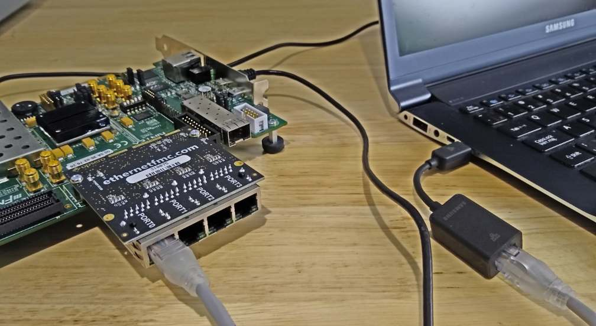
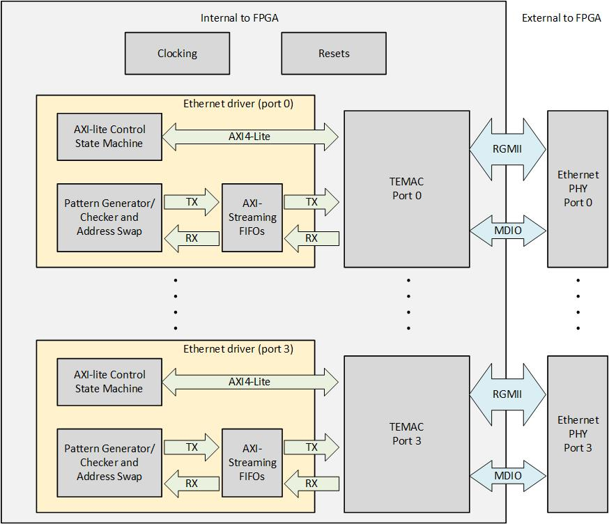

# Processorless Ethernet with FPGA



## Description

This repository contains example designs for experimenting with processorless (ie. state machine based) 
Ethernet on FPGAs. The base hardware is the Opsero [Ethernet FMC](https://ethernetfmc.com "Ethernet FMC") 
and the example designs support several FPGA development boards (listed below). The designs contain 4 TEMAC 
blocks driven by custom IP (Verilog) to handle PHY configuration, packet generation and packet checking, all 
from the FPGA fabric (no processor).



Each port is connected to its own TEMAC IP which is controlled by an independent IP module labelled "Ethernet driver"
as shown in the above image. Each Ethernet driver module contains the following elements:

* AXI-lite control state machine: For configuring the TEMAC and external PHY.
* Pattern generator/checker and address swap: For generating and checking Ethernet frames, and for swapping the 
destination/source addresses on frames when in loopback mode.
* AXI-Streaming FIFOs: For frame buffering.

As there is no processor in this design, the logic is entirely controlled by DIP switches and pushbuttons on
the FPGA dev board. The DIP switches determine the settings for all 4 ports and all ports have the same configuration
(ie. link speed, packet generator/checker enables).
If you need to configure each port with unique settings, due to the lack of DIP switches, we suggest you connect the 
setting inputs to fixed values inside the FPGA design.

## Requirements

This project is designed for version 2022.1 of Xilinx Vivado. 
If you are using an older version of the Xilinx tools, then refer to the 
[release tags](https://github.com/fpgadeveloper/ethernet-fmc-processorless/tags "releases")
to find the version of this repository that matches your version of the tools.

In order to test this design on hardware, you will need the following:

* Vivado 2022.1
* [Ethernet FMC](https://ethernetfmc.com "Ethernet FMC")
* One of the below listed evaluation boards
* [Xilinx Soft TEMAC license](https://ethernetfmc.com/getting-a-license-for-the-xilinx-tri-mode-ethernet-mac/ "Xilinx Soft TEMAC license")

## Supported carrier boards

* Artix-7 [AC701 Evaluation board](http://www.xilinx.com/ac701 "KC705 Evaluation board")
* Kintex-7 [KC705 Evaluation board](http://www.xilinx.com/kc705 "KC705 Evaluation board")
* Kintex Ultrascale [KCU105 Evaluation board](http://www.xilinx.com/kcu105 "KCU105 Evaluation board")
* Virtex-7 [VC707 Evaluation board](http://www.xilinx.com/vc707 "VC707 Evaluation board")
* Virtex-7 [VC709 Evaluation board](http://www.xilinx.com/vc709 "VC709 Evaluation board")
* Virtex UltraScale [VCU108 Evaluation board](http://www.xilinx.com/vcu108 "VCU108 Evaluation board")
* Virtex UltraScale+ [VCU118 Evaluation board](http://www.xilinx.com/vcu118 "VCU118 Evaluation board")

## Build instructions

To use the sources in this repository, please follow these steps:

### Windows users

1. Download the repo as a zip file and extract the files to a directory
   on your hard drive --OR-- Git users: clone the repo to your hard drive
2. Open Windows Explorer, browse to the repo files on your hard drive.
3. In the Vivado directory, you will find multiple batch files (*.bat).
   Double click on the batch file that is appropriate to your hardware,
   for example, double-click `build-ac701.bat` if you are using the AC701.
   This will generate a Vivado project for your hardware platform.
4. Run Vivado and open the project that was just created.
5. Click Generate bitstream.

### Linux users

1. Open a command terminal and launch the setup script for Vivado:
   ```
   source <path-to-vivado-install>/2022.1/settings64.sh
   ```
2. Clone the Git repository and `cd` into the `Vivado` folder of the repo:
   ```
   git clone https://github.com/fpgadeveloper/ethernet-fmc-processorless.git
   cd ethernet-fmc-processorless/Vivado
   ```
3. Run make to create the Vivado project for the target board. You must replace `<target>` with a valid
   target (alternatively, skip to step 5):
   ```
   make project TARGET=<target>
   ```
   Valid targets are: 
   `ac701`,`kc705_hpc`,`kc705_lpc`,`kcu105_hpc`,`vc707_hpc1`,`vc709`,`vcu108_hpc0`,`vcu118`.
   That will create the Vivado project and block design without generating a bitstream or exporting to XSA.
4. Open the generated project in the Vivado GUI and click **Generate Bitstream**. Once the build is
   complete, select **File->Export->Export Hardware** and be sure to tick **Include bitstream** and use
   the default name and location for the XSA file.
5. Alternatively, you can create the Vivado project, generate the bitstream and export to XSA (steps 3 and 4),
   all from a single command:
   ```
   make xsa TARGET=<target>
   ```

## Usage instructions

### Program FPGA

In Vivado, once the bitstream has been successfully generated, follow these instructions:

1. Attach the Ethernet FMC to the appropriate FMC connector on your FPGA dev board.
2. Power up the hardware.
3. Click `Open Hardware Manager`.
4. Select `Open target->Auto Connect`.
5. Click `Program device` and click OK.

### Testing on hardware

When the FPGA dev board has been programmed with the bitstream, you should see the FPGA_DONE LED light up.
From this point you can test the design on the hardware.

1. Connect Ethernet FMC port(s) to a PC or to each other
2. Set the DIP switches to the desired settings (see below)
3. Press the center pushbutton to establish a link
4. Use Ethernet monitoring tools (such as Wireshark) to observe the packet flow

As this design has no processor, it is completely controlled by DIP switches and pushbuttons on the FPGA dev
board. The following sections describe the available settings and controls.

### DIP switches

The 4 DIP switches are used to set the Ethernet link speed and to enable/disable the packet generators and
packet checkers.

| DIP  | Function                 |
|------|--------------------------|
| 1    | MAC Speed(0)             |
| 2    | MAC Speed(1)             |
| 3    | Enable Pattern Generator |
| 4    | Enable Pattern Checker   |

The link speed can be set using DIP switches 1 and 2 as shown in the table below.

| MAC Speed(0) | MAC Speed(1) | Link speed |
|--------------|--------------|------------|
| 0            | 0            | 10Mbps     |
| 1            | 0            | 100Mbps    |
| X            | 1            | 1000Mbps   |

When the pattern generator is disabled, all of the ports are in a loopback mode whereby all of the 
received frames are sent back out the same port after having their destination and 
source addresses swapped. This functionality can be verified by connecting one of
the ports to a PC running Wireshark.

When the packet generator is enabled, all of the ports output a continuous stream of packets.
If the packet checker is also enabled, all received packets are checked for conformity with the frame
format and content determined by the packet generator. If bit errors occur, they are indicated by the LEDs.

To help you locate the appropriate DIP switch on the FPGA dev board, the designators are listed below:

* **AC701**: SW2
* **KC705**: SW11
* **KCU105**: SW12
* **VC707**: SW2 (has 8 bits but we only use the first 4)
* **VC709**: SW2 (has 8 bits but we only use the first 4)
* **VCU108**: SW12
* **VCU118**: SW12

### Push buttons

The pushbuttons can be used to trigger a link speed update or an error count reset:

| Pushbutton  | Function                 |
|-------------|--------------------------|
| CENTER      | Update link speed        |
| NORTH       | Reset error count        |
| WEST        | config_board             |
| SOUTH       | pause_req_s              |
| EAST        | NOT USED                 |

### LEDs

The user LEDs are used to display the link activity and frame errors of the ports.
All designs use 8 LEDs as shown in the table below, except for the AC701 which only has 4 LEDs
and thus only shows the status of the first 2 ports.

| LED    | Function                 |
|--------|--------------------------|
| 0      | Port 0: Frame Error      |
| 1      | Port 0: Activity         |
| 2      | Port 1: Frame Error      |
| 3      | Port 1: Activity         |
| 4      | Port 2: Frame Error      |
| 5      | Port 2: Activity         |
| 6      | Port 3: Frame Error      |
| 7      | Port 3: Activity         |

## More information

This design originates from the Xilinx TEMAC example design that can be generated by Vivado. You can read more about
the functioning of this example design in the Xilinx documentation:

[PG051 - Tri-Mode Ethernet MAC v9.0 Product Guide](https://docs.xilinx.com/r/en-US/pg051-tri-mode-eth-mac)

We've also written about generating and working with the design here:

[Driving Ethernet ports without a processor](https://www.fpgadeveloper.com/driving-ethernet-ports-without-a-processor/ "Processorless Ethernet")

## Contribute

We encourage contribution to these projects. If you spot issues or you want to add designs for other platforms, please
make a pull request.

## About us

This project was developed by [Opsero Inc.](https://opsero.com "Opsero Inc."),
a tight-knit team of FPGA experts delivering FPGA products and design services to start-ups and tech companies. 
Follow our blog, [FPGA Developer](https://www.fpgadeveloper.com "FPGA Developer"), for news, tutorials and
updates on the awesome projects we work on.
